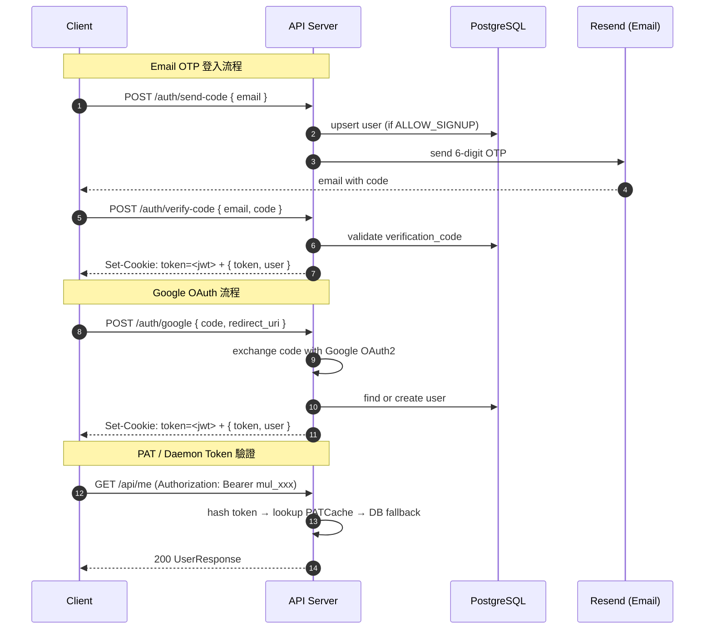

# API_SURFACE.md — Multica API 與介面參考文件

> 資料截止：2026-05-05  
> Backend：Go 1.26.1 + Chi v5.2.5  
> Base URL：`https://api.multica.ai`（self-hosted 可自訂）

---

## 目錄

1. [認證與授權](#1-認證與授權)
2. [REST API 概覽](#2-rest-api-概覽)
3. [關鍵 API 詳情](#3-關鍵-api-詳情)
4. [WebSocket 協議](#4-websocket-協議)
5. [Daemon API](#5-daemon-api)
6. [Error Handling](#6-error-handling)

---

## 1. 認證與授權

### 1.1 三種認證方式

| 方式 | Token 格式 | 使用情境 |
|------|-----------|---------|
| **JWT Cookie** | HttpOnly cookie `token=<jwt>` | Web / Desktop 前端（預設） |
| **Personal Access Token (PAT)** | `Authorization: Bearer mul_<hex>` | CLI、第三方整合、WS 連線 |
| **Daemon Token** | `Authorization: Bearer mdt_<hex>` | Daemon runtime 專用，限 `/api/daemon/` 路由 |

**JWT 規格：**
- 演算法：HMAC-SHA256（`JWT_SECRET` 環境變數）
- 有效期：30 天
- Claims：`sub`（user UUID）、`email`、`name`、`exp`、`iat`

**PAT 特性：**
- Redis 快取加速驗證（`PATCache`），缺 Redis 時退回 DB 查詢
- 每次使用自動更新 `last_used_at`
- WS 連線也支援 PAT 驗證

### 1.2 認證流程圖



### 1.3 Workspace Middleware

所有 workspace 範疇的 API 需要透過以下任一方式提供 workspace 識別：

| Header | 說明 |
|--------|------|
| `X-Workspace-ID` | Workspace UUID（優先） |
| `X-Workspace-Slug` | Workspace slug（server 自動解析為 UUID） |

`middleware.RequireWorkspaceMember` 驗證：
1. 解析 workspace ID/slug → UUID
2. 確認 user 為該 workspace 的 member
3. 將 `member` 物件注入 request context

Admin 操作（`PUT /api/workspaces/{id}`）要求 role 為 `owner` 或 `admin`。  
刪除 workspace 僅 `owner` 可執行。

### 1.4 Agent 身份代理

Agent 執行任務時可在 request header 宣告身份：

| Header | 說明 |
|--------|------|
| `X-Agent-ID` | Agent UUID（需屬於當前 workspace） |
| `X-Task-ID` | 任務 UUID（交叉驗證 agent 擁有此 task） |

解析成功後，`creator_type` / `actor_type` 記錄為 `"agent"`，否則退回 `"member"`。

---

## 2. REST API 概覽

### 2.1 公開端點（無需認證）

| Method | Path | 說明 |
|--------|------|------|
| `GET` | `/health` | Liveness check |
| `GET` | `/readyz` | Readiness check |
| `GET` | `/healthz` | Readiness check（別名） |
| `GET` | `/health/realtime` | Realtime WS 指標（可設 Bearer token 保護） |
| `GET` | `/ws` | WebSocket 連線升級端點 |
| `POST` | `/auth/send-code` | 發送 email OTP |
| `POST` | `/auth/verify-code` | 驗證 OTP，回傳 JWT |
| `POST` | `/auth/google` | Google OAuth 登入 |
| `POST` | `/auth/logout` | 清除 cookie |
| `GET` | `/api/config` | 取得 server 設定（signup 是否開放等） |

### 2.2 使用者範疇端點（需 JWT/PAT）

| Method | Path | 說明 |
|--------|------|------|
| `GET` | `/api/me` | 取得當前使用者資料 |
| `PATCH` | `/api/me` | 更新使用者資料 |
| `POST` | `/api/me/onboarding/complete` | 完成 onboarding |
| `POST` | `/api/cli-token` | 發行 CLI PAT |
| `POST` | `/api/upload-file` | 上傳檔案附件 |
| `POST` | `/api/feedback` | 提交回饋 |
| `GET` | `/api/workspaces` | 列出使用者所屬的所有 workspace |
| `POST` | `/api/workspaces` | 建立新 workspace |
| `GET` | `/api/workspaces/{id}` | 取得 workspace 詳情 |
| `PUT/PATCH` | `/api/workspaces/{id}` | 更新 workspace（admin+） |
| `DELETE` | `/api/workspaces/{id}` | 刪除 workspace（owner only） |
| `GET` | `/api/workspaces/{id}/members` | 列出 workspace 成員 |
| `POST` | `/api/workspaces/{id}/leave` | 離開 workspace |
| `GET` | `/api/invitations` | 列出收到的邀請 |
| `POST` | `/api/invitations/{id}/accept` | 接受邀請 |
| `POST` | `/api/invitations/{id}/decline` | 拒絕邀請 |
| `GET` | `/api/tokens` | 列出 PAT |
| `POST` | `/api/tokens` | 建立 PAT |
| `DELETE` | `/api/tokens/{id}` | 撤銷 PAT |

### 2.3 Workspace 範疇端點（需 Workspace Membership）

#### Issues

| Method | Path | 說明 |
|--------|------|------|
| `GET` | `/api/issues` | 列出 issues（支援篩選） |
| `POST` | `/api/issues` | 建立 issue |
| `POST` | `/api/issues/quick-create` | AI 快速建立 issue（非同步） |
| `GET` | `/api/issues/search` | 搜尋 issues |
| `POST` | `/api/issues/batch-update` | 批次更新 issues |
| `POST` | `/api/issues/batch-delete` | 批次刪除 issues |
| `GET` | `/api/issues/{id}` | 取得單一 issue（支援 UUID 或 `PREFIX-NUMBER` 格式） |
| `PUT` | `/api/issues/{id}` | 更新 issue |
| `DELETE` | `/api/issues/{id}` | 刪除 issue |
| `GET` | `/api/issues/{id}/comments` | 列出評論 |
| `POST` | `/api/issues/{id}/comments` | 新增評論 |
| `GET` | `/api/issues/{id}/timeline` | 取得 issue 時間軸 |
| `GET` | `/api/issues/{id}/active-task` | 取得進行中任務 |
| `POST` | `/api/issues/{id}/tasks/{taskId}/cancel` | 取消任務 |
| `POST` | `/api/issues/{id}/rerun` | 重新執行 |
| `GET` | `/api/issues/{id}/task-runs` | 列出歷史任務 |
| `GET` | `/api/issues/{id}/usage` | 取得 token 用量 |
| `POST` | `/api/issues/{id}/reactions` | 新增 reaction |
| `GET` | `/api/issues/{id}/children` | 列出子 issue |
| `POST` | `/api/issues/{id}/labels` | 附加 label |
| `DELETE` | `/api/issues/{id}/labels/{labelId}` | 移除 label |

#### Agents

| Method | Path | 說明 |
|--------|------|------|
| `GET` | `/api/agents` | 列出 agents |
| `POST` | `/api/agents` | 建立 agent |
| `GET` | `/api/agents/{id}` | 取得 agent |
| `PUT` | `/api/agents/{id}` | 更新 agent |
| `POST` | `/api/agents/{id}/archive` | 封存 agent |
| `POST` | `/api/agents/{id}/restore` | 還原 agent |
| `POST` | `/api/agents/{id}/cancel-tasks` | 取消 agent 所有任務 |
| `GET` | `/api/agents/{id}/tasks` | 列出 agent 任務 |
| `GET` | `/api/agents/{id}/skills` | 列出 agent 技能 |
| `PUT` | `/api/agents/{id}/skills` | 設定 agent 技能清單 |

#### 其他資源

| Method | Path | 說明 |
|--------|------|------|
| `GET/POST/PUT/DELETE` | `/api/labels/...` | 標籤 CRUD |
| `GET/POST/PUT/DELETE` | `/api/projects/...` | 專案 CRUD |
| `GET/POST/PUT/DELETE` | `/api/skills/...` | 技能 CRUD |
| `GET/POST/PATCH/DELETE` | `/api/autopilots/...` | Autopilot CRUD |
| `POST` | `/api/autopilots/{id}/trigger` | 手動觸發 autopilot |
| `GET/POST/DELETE` | `/api/chat/sessions/...` | Chat session 管理 |
| `POST` | `/api/chat/sessions/{id}/messages` | 發送 chat 訊息 |
| `GET` | `/api/inbox` | 收件匣列表 |
| `POST` | `/api/inbox/mark-all-read` | 全部標為已讀 |
| `GET` | `/api/runtimes` | 列出 agent runtimes |
| `GET` | `/api/usage/daily` | 每日用量 |
| `GET` | `/api/usage/summary` | 用量摘要 |
| `GET` | `/api/agent-task-snapshot` | Workspace agent 任務快照（Presence 用） |

---

## 3. 關鍵 API 詳情

### 3.1 POST /auth/send-code

發送 email 驗證碼（OTP 登入第一步）。

**Request**
```json
POST /auth/send-code
Content-Type: application/json

{
  "email": "user@example.com"
}
```

**Response** `200 OK`
```json
{ "message": "code sent" }
```

**備註：**
- 若 `ALLOW_SIGNUP=false` 且 email 非已知用戶，返回 `403 Forbidden`
- 若 `RESEND_API_KEY` 未設定，驗證碼印到 server log（開發模式）
- 開發可設 `MULTICA_DEV_VERIFICATION_CODE=123456` 跳過 email

---

### 3.2 POST /api/issues

建立新 issue。需要 `X-Workspace-ID` header。

**Request**
```json
POST /api/issues
Authorization: Bearer mul_<token>
X-Workspace-ID: <workspace-uuid>
Content-Type: application/json

{
  "title": "Fix authentication bug",
  "description": "JWT tokens expire too early",
  "status": "todo",
  "priority": "high",
  "assignee_type": "agent",
  "assignee_id": "<agent-uuid>",
  "parent_issue_id": null,
  "project_id": "<project-uuid>",
  "due_date": "2026-06-01T00:00:00Z",
  "attachment_ids": ["<attachment-uuid>"]
}
```

**Response** `201 Created`
```json
{
  "id": "<uuid>",
  "workspace_id": "<uuid>",
  "number": 42,
  "identifier": "MUL-42",
  "title": "Fix authentication bug",
  "description": "JWT tokens expire too early",
  "status": "todo",
  "priority": "high",
  "assignee_type": "agent",
  "assignee_id": "<agent-uuid>",
  "creator_type": "member",
  "creator_id": "<user-uuid>",
  "parent_issue_id": null,
  "project_id": "<project-uuid>",
  "position": 65536.0,
  "due_date": "2026-06-01T00:00:00Z",
  "created_at": "2026-05-05T10:00:00Z",
  "updated_at": "2026-05-05T10:00:00Z"
}
```

**欄位說明：**
- `status`：`todo` | `in_progress` | `done` | `cancelled`（預設 `todo`）
- `priority`：`none` | `low` | `medium` | `high` | `urgent`（預設 `none`）
- `assignee_type`：`member` | `agent`（搭配 `assignee_id`）
- `identifier`：自動生成，格式為 `{workspace_prefix}-{number}`

---

### 3.3 PUT /api/issues/{id}

更新 issue。`{id}` 接受 UUID 或 `PREFIX-NUMBER` 格式（如 `MUL-42`）。

**Request**
```json
PUT /api/issues/MUL-42
X-Workspace-ID: <workspace-uuid>
Content-Type: application/json

{
  "title": "Updated title",
  "status": "in_progress",
  "priority": "urgent",
  "assignee_type": "agent",
  "assignee_id": "<agent-uuid>"
}
```

**Response** `200 OK` — 同 `IssueResponse`（不含 `labels` 欄位，客戶端保留快取中的 labels）

---

### 3.4 POST /api/daemon/runtimes/{runtimeId}/tasks/claim

Daemon 認領下一個可執行任務（原子操作）。

**Auth：** `Authorization: Bearer mdt_<token>`（Daemon Token）

**Request**
```json
POST /api/daemon/runtimes/<runtime-uuid>/tasks/claim
Authorization: Bearer mdt_<token>
Content-Type: application/json

{}
```

**Response** `200 OK`（有任務）
```json
{
  "task": {
    "id": "<task-uuid>",
    "issue_id": "<issue-uuid>",
    "agent_id": "<agent-uuid>",
    "runtime_id": "<runtime-uuid>",
    "status": "dispatched",
    "type": "issue",
    "prompt": "<task prompt>",
    "skills": ["<skill content>"],
    "repos": [{ "url": "https://github.com/org/repo" }],
    "session_id": "<previous-claude-session-id>",
    "created_at": "2026-05-05T10:00:00Z"
  }
}
```

**Response** `200 OK`（無任務）
```json
{ "task": null }
```

---

### 3.5 POST /api/chat/sessions/{id}/messages

向 Chat Session 發送訊息並觸發 agent 任務。

**Request**
```json
POST /api/chat/sessions/<session-uuid>/messages
X-Workspace-ID: <workspace-uuid>
Content-Type: application/json

{
  "content": "請幫我分析這段程式碼的效能瓶頸"
}
```

**Response** `201 Created`
```json
{
  "message_id": "<message-uuid>",
  "task_id": "<task-uuid>",
  "created_at": "2026-05-05T10:00:00Z"
}
```

**後續流程：** Client 透過 WebSocket 訂閱 `chat:message`、`task:progress`、`chat:done` 事件接收 agent 回應。

---

## 4. WebSocket 協議

### 4.1 連線

```
GET /ws
Upgrade: websocket

# Cookie Auth（前端）
Cookie: token=<jwt>

# PAT Auth（CLI / 程式）
Authorization: Bearer mul_<token>

# Workspace 過濾（可選）
# Query param: ?workspace_id=<uuid> 或 ?workspace_slug=<slug>
```

伺服器驗證 Origin 是否在 `CORS_ALLOWED_ORIGINS` 白名單內。

### 4.2 事件列表

所有事件格式為 `{ "type": "<event>", "payload": <object> }`。

#### Issue 事件

| 事件 | 觸發時機 | Payload 重點 |
|------|---------|-------------|
| `issue:created` | 新 issue 建立 | 完整 `IssueResponse` |
| `issue:updated` | issue 欄位更新 | 部分更新的 `IssueResponse`（不含 labels） |
| `issue:deleted` | issue 刪除 | `{ id }` |
| `issue_labels:changed` | labels 附加/移除 | `{ issue_id, labels[] }` |

#### Task 事件

| 事件 | 觸發時機 | 說明 |
|------|---------|------|
| `task:queued` | 任務入隊 | `∅ → queued` 狀態轉換 |
| `task:dispatch` | Daemon 認領任務 | `queued → dispatched` |
| `task:progress` | Agent 回報進度 | `{ summary, step, total }` |
| `task:message` | Agent 發送訊息片段 | streaming 訊息內容 |
| `task:completed` | 任務完成 | `running → completed`，含 PR URL |
| `task:failed` | 任務失敗 | `running → failed`，含錯誤訊息 |
| `task:cancelled` | 任務取消 | 任意狀態 → cancelled |

#### Chat 事件

| 事件 | 觸發時機 |
|------|---------|
| `chat:message` | Agent 回應訊息（streaming） |
| `chat:done` | Chat session 回應完成 |
| `chat:session_read` | 用戶標記 session 已讀 |

#### Inbox 事件

| 事件 | 觸發時機 |
|------|---------|
| `inbox:new` | 新收件匣項目 |
| `inbox:read` | 單項目標為已讀 |
| `inbox:archived` | 單項目封存 |
| `inbox:batch-read` | 批次已讀 |
| `inbox:batch-archived` | 批次封存 |

#### Agent / Runtime 事件

| 事件 | 觸發時機 |
|------|---------|
| `agent:status` | Agent 狀態變更 |
| `agent:created` | 新 agent 建立 |
| `agent:archived` | Agent 封存 |
| `agent:restored` | Agent 還原 |

#### Daemon 事件（Daemon WS 專用）

| 事件 | 觸發時機 |
|------|---------|
| `daemon:register` | Daemon 完成註冊 |
| `daemon:heartbeat` | Daemon 傳送心跳 |
| `daemon:heartbeat_ack` | Server 確認心跳 |
| `daemon:task_available` | 有新任務可認領（wakeup） |

#### 其他事件

| 事件 | 觸發時機 |
|------|---------|
| `comment:created/updated/deleted` | 評論 CRUD |
| `reaction:added/removed` | 評論 reaction |
| `issue_reaction:added/removed` | Issue reaction |
| `workspace:updated/deleted` | Workspace 變更 |
| `member:added/updated/removed` | 成員異動 |
| `skill:created/updated/deleted` | Skill CRUD |
| `project:created/updated/deleted` | Project CRUD |
| `label:created/updated/deleted` | Label CRUD |
| `autopilot:created/updated/deleted` | Autopilot CRUD |
| `autopilot:run_start/run_done` | Autopilot 執行 |
| `invitation:created/accepted/declined/revoked` | 邀請事件 |
| `pin:created/deleted/reordered` | Pin 事件 |
| `activity:created` | Activity log |

---

## 5. Daemon API

Daemon API 使用 `mdt_` prefix 的 Daemon Token 或有效的 User JWT / PAT 認證（fallback）。  
所有路由前綴：`/api/daemon/`

### 5.1 Daemon 生命週期

| Method | Path | 說明 |
|--------|------|------|
| `POST` | `/api/daemon/register` | 向 server 註冊 daemon 及其 runtimes |
| `POST` | `/api/daemon/deregister` | 取消註冊 |
| `POST` | `/api/daemon/heartbeat` | 定期心跳（預設每 15 秒），含任務 claim 邏輯 |
| `GET` | `/api/daemon/ws` | Daemon 專用 WebSocket（接收 wakeup 通知） |

**DaemonRegisterRequest：**
```json
{
  "workspace_id": "<workspace-uuid>",
  "daemon_id": "<persistent-uuid>",
  "device_name": "MacBook-Pro",
  "cli_version": "0.2.0",
  "launched_by": "desktop",
  "runtimes": [
    { "name": "claude-code", "type": "claude", "version": "1.2.3", "status": "online" }
  ]
}
```

### 5.2 任務執行生命週期

| Method | Path | 說明 |
|--------|------|------|
| `POST` | `/api/daemon/runtimes/{runtimeId}/tasks/claim` | 原子認領任務 |
| `GET` | `/api/daemon/runtimes/{runtimeId}/tasks/pending` | 查詢 pending 任務清單 |
| `GET` | `/api/daemon/tasks/{taskId}/status` | 取得任務狀態 |
| `POST` | `/api/daemon/tasks/{taskId}/start` | 標記任務開始執行 |
| `POST` | `/api/daemon/tasks/{taskId}/progress` | 回報執行進度 |
| `POST` | `/api/daemon/tasks/{taskId}/complete` | 回報完成（含 PR URL、output） |
| `POST` | `/api/daemon/tasks/{taskId}/fail` | 回報失敗（含錯誤訊息） |
| `POST` | `/api/daemon/tasks/{taskId}/messages` | 回報任務訊息（streaming 片段） |
| `GET` | `/api/daemon/tasks/{taskId}/messages` | 列出任務訊息 |
| `POST` | `/api/daemon/tasks/{taskId}/usage` | 回報 token 用量 |
| `POST` | `/api/daemon/tasks/{taskId}/session` | 記錄 Claude session ID（供下次 resume） |
| `POST` | `/api/daemon/runtimes/{runtimeId}/recover-orphans` | 重新領取遺棄的任務 |

**TaskProgressRequest：**
```json
{
  "summary": "Running tests...",
  "step": 3,
  "total": 5
}
```

**TaskCompleteRequest：**
```json
{
  "pr_url": "https://github.com/org/repo/pull/123",
  "output": "All tests pass. Created PR #123.",
  "session_id": "<claude-session-uuid>",
  "work_dir": "/home/user/.multica/workspaces/repo"
}
```

### 5.3 Runtime 管理（User 側）

| Method | Path | 說明 |
|--------|------|------|
| `GET` | `/api/runtimes` | 列出 workspace 的所有 runtimes |
| `DELETE` | `/api/runtimes/{runtimeId}` | 刪除 runtime 記錄 |
| `POST` | `/api/runtimes/{runtimeId}/update` | 觸發 CLI 更新請求 |
| `POST` | `/api/runtimes/{runtimeId}/models` | 請求 runtime 列出可用 AI models |
| `POST` | `/api/runtimes/{runtimeId}/local-skills` | 請求 runtime 列出本地 skills |
| `GET` | `/api/runtimes/{runtimeId}/usage` | 取得 runtime 用量統計 |
| `GET` | `/api/runtimes/{runtimeId}/activity` | 取得 runtime 任務活動記錄 |

---

## 6. Error Handling

### 6.1 Error Response 格式

所有錯誤均返回 JSON：

```json
{
  "error": "human-readable error message"
}
```

`Content-Type: application/json`

### 6.2 常見 HTTP 狀態碼

| 狀態碼 | 情境 |
|--------|------|
| `400 Bad Request` | 請求格式錯誤、必填欄位缺失、UUID 格式無效 |
| `401 Unauthorized` | 未提供 token 或 token 無效/過期 |
| `403 Forbidden` | 已認證但無權限（如非 admin 執行 admin 操作） |
| `404 Not Found` | 資源不存在或不屬於當前 workspace |
| `409 Conflict` | 唯一性衝突（如 workspace slug 重複） |
| `500 Internal Server Error` | Server 內部錯誤（DB 故障等） |
| `503 Service Unavailable` | 第三方服務未設定（如 Google OAuth 未配置） |

### 6.3 UUID 驗證規則

後端 handler 嚴格區分兩種 UUID 解析方式（參見 Issue #1661 修復）：

- **來自用戶輸入的 UUID**（URL 參數、request body）→ 使用 `parseUUIDOrBadRequest`，無效時返回 `400`
- **來自 DB 的 UUID round-trip** → 使用 `parseUUID`（panic on invalid，由 `middleware.Recoverer` 轉為 `500`）

### 6.4 Issue ID 解析

`GET/PUT/DELETE /api/issues/{id}` 的 `{id}` 支援兩種格式：

1. **UUID**：標準 UUID 格式
2. **Identifier**：`PREFIX-NUMBER` 格式（如 `MUL-42`）— server 自動解析

---

*最後更新：2026-05-05*  
*來源：`server/cmd/server/router.go`、`server/pkg/protocol/events.go`、`server/internal/handler/`*
