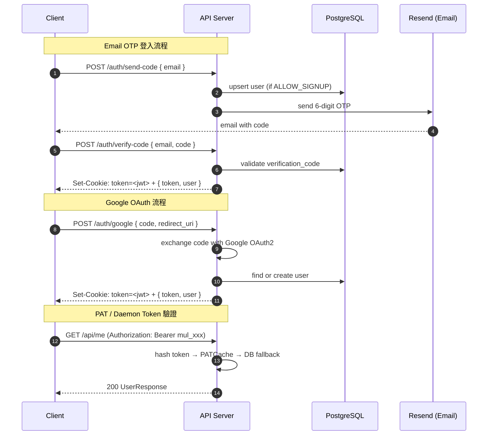

# API_SURFACE.md — Multica API 與介面參考文件（Part 1/2）

> 資料截止：2026-05-09 | Backend：Go 1.26.1 + Chi v5.2.5 | Base URL：`https://api.multica.ai`  
> 續見 [API_SURFACE_part2.md](./API_SURFACE_part2.md)

---

## 目錄

1. [認證與授權](#1-認證與授權)
2. [REST API 概覽](#2-rest-api-概覽)
3. [關鍵 API 詳情（前半）](#3-關鍵-api-詳情前半)

---

## 1. 認證與授權

### 1.1 三種認證方式

| 方式 | Token 格式 | 使用情境 |
|------|-----------|---------|
| **JWT Cookie** | HttpOnly cookie `token=<jwt>` | Web / Desktop 前端（預設） |
| **Personal Access Token (PAT)** | `Authorization: Bearer mul_<hex>` | CLI、第三方整合、WS 連線 |
| **Daemon Token** | `Authorization: Bearer mdt_<hex>` | Daemon runtime 專用，限 `/api/daemon/` 路由 |

**JWT 規格：**
- 演算法：HMAC-SHA256（`JWT_SECRET` 環境變數）
- 有效期：30 天
- Claims：`sub`（user UUID）、`email`、`name`、`exp`、`iat`

**PAT 特性：**
- Redis 快取加速驗證（`PATCache`），缺 Redis 時退回 DB 查詢
- 每次使用自動更新 `last_used_at`
- WS 連線也支援 PAT 驗證

### 1.2 認證流程圖



### 1.3 Workspace Middleware

所有 workspace 範疇的 API 需在 request header 提供 workspace 識別：

| Header | 說明 |
|--------|------|
| `X-Workspace-ID` | Workspace UUID（優先） |
| `X-Workspace-Slug` | Workspace slug（server 自動解析） |

`middleware.RequireWorkspaceMember` 驗證流程：
1. 解析 workspace ID/slug → UUID
2. 確認 user 為該 workspace 的 member
3. 將 `member` 物件注入 request context

Admin 操作需 role 為 `owner` 或 `admin`；刪除 workspace 僅 `owner` 可執行。

### 1.4 Agent 身份代理

Agent 執行任務時可在 request header 宣告身份（選用）：

| Header | 說明 |
|--------|------|
| `X-Agent-ID` | Agent UUID（需屬於當前 workspace） |
| `X-Task-ID` | 任務 UUID（交叉驗證 agent 擁有此 task） |

解析成功後，`creator_type` / `actor_type` 記錄為 `"agent"`，否則退回 `"member"`。

---

## 2. REST API 概覽

### 2.1 公開端點（無需認證）

| Method | Path | 說明 |
|--------|------|------|
| `GET` | `/health` | Liveness check |
| `GET` | `/readyz` | Readiness check |
| `GET` | `/health/realtime` | Realtime WS 指標（可設 Bearer token 保護） |
| `GET` | `/ws` | WebSocket 連線升級端點 |
| `POST` | `/auth/send-code` | 發送 email OTP |
| `POST` | `/auth/verify-code` | 驗證 OTP，回傳 JWT |
| `POST` | `/auth/google` | Google OAuth 登入 |
| `POST` | `/auth/logout` | 清除 cookie |
| `GET` | `/api/config` | 取得 server 設定（signup 是否開放等） |

### 2.2 使用者範疇端點（需 JWT/PAT）

| Method | Path | 說明 |
|--------|------|------|
| `GET` | `/api/me` | 取得當前使用者資料 |
| `PATCH` | `/api/me` | 更新使用者資料 |
| `POST` | `/api/me/onboarding/complete` | 完成 onboarding |
| `POST` | `/api/cli-token` | 發行 CLI PAT |
| `POST` | `/api/upload-file` | 上傳檔案附件 |
| `POST` | `/api/feedback` | 提交回饋 |
| `GET` | `/api/workspaces` | 列出使用者所屬的所有 workspace |
| `POST` | `/api/workspaces` | 建立新 workspace |
| `GET` | `/api/workspaces/{id}` | 取得 workspace 詳情 |
| `PUT/PATCH` | `/api/workspaces/{id}` | 更新 workspace（admin+） |
| `DELETE` | `/api/workspaces/{id}` | 刪除 workspace（owner only） |
| `GET` | `/api/workspaces/{id}/members` | 列出 workspace 成員 |
| `POST` | `/api/workspaces/{id}/leave` | 離開 workspace |
| `GET` | `/api/invitations` | 列出收到的邀請 |
| `POST` | `/api/invitations/{id}/accept` | 接受邀請 |
| `POST` | `/api/invitations/{id}/decline` | 拒絕邀請 |
| `GET` | `/api/tokens` | 列出 PAT |
| `POST` | `/api/tokens` | 建立 PAT |
| `DELETE` | `/api/tokens/{id}` | 撤銷 PAT |

### 2.3 Workspace 範疇端點（需 Workspace Membership）

#### Issues

| Method | Path | 說明 |
|--------|------|------|
| `GET` | `/api/issues` | 列出 issues（支援篩選） |
| `POST` | `/api/issues` | 建立 issue |
| `POST` | `/api/issues/quick-create` | AI 快速建立 issue（非同步） |
| `GET` | `/api/issues/search` | 搜尋 issues |
| `POST` | `/api/issues/batch-update` | 批次更新 issues |
| `POST` | `/api/issues/batch-delete` | 批次刪除 issues |
| `GET` | `/api/issues/{id}` | 取得單一 issue（支援 UUID 或 `PREFIX-NUMBER`） |
| `PUT` | `/api/issues/{id}` | 更新 issue |
| `DELETE` | `/api/issues/{id}` | 刪除 issue |
| `GET` | `/api/issues/{id}/comments` | 列出評論 |
| `POST` | `/api/issues/{id}/comments` | 新增評論 |
| `GET` | `/api/issues/{id}/timeline` | 取得 issue 時間軸 |
| `GET` | `/api/issues/{id}/active-task` | 取得進行中任務 |
| `POST` | `/api/issues/{id}/tasks/{taskId}/cancel` | 取消任務 |
| `POST` | `/api/issues/{id}/rerun` | 重新執行 |
| `GET` | `/api/issues/{id}/task-runs` | 列出歷史任務 |
| `GET` | `/api/issues/{id}/usage` | 取得 token 用量 |
| `GET` | `/api/issues/{id}/children` | 列出子 issue |
| `POST` | `/api/issues/{id}/labels` | 附加 label |
| `DELETE` | `/api/issues/{id}/labels/{labelId}` | 移除 label |

#### Agents

| Method | Path | 說明 |
|--------|------|------|
| `GET` | `/api/agents` | 列出 agents |
| `POST` | `/api/agents` | 建立 agent |
| `GET` | `/api/agents/{id}` | 取得 agent |
| `PUT` | `/api/agents/{id}` | 更新 agent |
| `POST` | `/api/agents/{id}/archive` | 封存 agent |
| `POST` | `/api/agents/{id}/restore` | 還原 agent |
| `POST` | `/api/agents/{id}/cancel-tasks` | 取消所有任務 |
| `GET` | `/api/agents/{id}/tasks` | 列出 agent 任務 |
| `PUT` | `/api/agents/{id}/skills` | 設定 agent 技能清單 |

#### 其他資源

| Method | Path | 說明 |
|--------|------|------|
| `GET/POST/PUT/DELETE` | `/api/labels/...` | 標籤 CRUD |
| `GET/POST/PUT/DELETE` | `/api/projects/...` | 專案 CRUD |
| `GET/POST/PUT/DELETE` | `/api/skills/...` | 技能 CRUD（`GET /api/workspaces/:id/skills` 不含 `content` 欄位，PR #2180） |
| `POST` | `/api/workspaces/:id/skills/import-from-url` | 從 GitHub URL 匯入 skill |
| `GET/POST/PATCH/DELETE` | `/api/autopilots/...` | Autopilot CRUD |
| `POST` | `/api/autopilots/{id}/trigger` | 手動觸發 autopilot |
| `GET/POST/DELETE` | `/api/chat/sessions/...` | Chat session 管理 |
| `DELETE` | `/api/workspaces/:id/chat/sessions/:sessionId` | 刪除 chat session |
| `POST` | `/api/chat/sessions/{id}/messages` | 發送 chat 訊息 |
| `GET` | `/api/inbox` | 收件匣列表 |
| `POST` | `/api/inbox/mark-all-read` | 全部標為已讀 |
| `GET` | `/api/runtimes` | 列出 agent runtimes |
| `GET` | `/api/usage/daily` | 每日用量 |
| `GET` | `/api/usage/summary` | 用量摘要 |
| `GET` | `/api/agent-task-snapshot` | Workspace agent 任務快照 |

---

## 3. 關鍵 API 詳情（前半）

### 3.1 POST /auth/send-code

**Request**
```json
POST /auth/send-code
Content-Type: application/json

{ "email": "user@example.com" }
```

**Response** `200 OK`
```json
{ "message": "code sent" }
```

備註：`ALLOW_SIGNUP=false` 且 email 非已知用戶時返回 `403`。  
開發可設 `MULTICA_DEV_VERIFICATION_CODE=123456` 跳過 email 發送。

---

### 3.2 POST /api/issues

**Request**
```json
POST /api/issues
X-Workspace-ID: <workspace-uuid>
Content-Type: application/json

{
  "title": "Fix authentication bug",
  "description": "JWT tokens expire too early",
  "status": "todo",
  "priority": "high",
  "assignee_type": "agent",
  "assignee_id": "<agent-uuid>",
  "project_id": "<project-uuid>",
  "due_date": "2026-06-01T00:00:00Z"
}
```

**Response** `201 Created` — `IssueResponse`：

```json
{
  "id": "<uuid>",
  "workspace_id": "<uuid>",
  "number": 42,
  "identifier": "MUL-42",
  "title": "Fix authentication bug",
  "description": "JWT tokens expire too early",
  "status": "todo",
  "priority": "high",
  "assignee_type": "agent",
  "assignee_id": "<agent-uuid>",
  "creator_type": "member",
  "creator_id": "<user-uuid>",
  "parent_issue_id": null,
  "project_id": "<project-uuid>",
  "position": 65536.0,
  "due_date": "2026-06-01T00:00:00Z",
  "created_at": "2026-05-05T10:00:00Z",
  "updated_at": "2026-05-05T10:00:00Z"
}
```

`status` 預設 `todo`；`priority` 預設 `none`。`identifier` 格式為 `{workspace_prefix}-{number}`，自動生成。

---

### 3.3 PUT /api/issues/{id}

`{id}` 接受 UUID 或 `PREFIX-NUMBER` 格式（如 `MUL-42`）。

**Request**
```json
PUT /api/issues/MUL-42
X-Workspace-ID: <workspace-uuid>
Content-Type: application/json

{
  "title": "Updated title",
  "status": "in_progress",
  "priority": "urgent",
  "assignee_type": "agent",
  "assignee_id": "<agent-uuid>"
}
```

**Response** `200 OK` — `IssueResponse`（不含 `labels` 欄位；客戶端保留快取中的 labels）

---

## 附錄 A. CLI 指令參考

> 指令格式：`multica <subcommand> [flags]`

### 最新新增指令（v0.2+ / PR 參考）

| 指令 | 說明 | PR |
|------|------|-----|
| `multica workspace update` | 更新 workspace 設定（名稱、slug 等） | #2191 |
| `multica daemon disk-usage` | 顯示每個任務 / workspace 的磁碟占用量 | #2267 |

### 新增通用 Flags

| Flag | 適用指令 | 說明 | PR |
|------|---------|------|-----|
| `--assignee-id` | `issue create/update` | 直接指定 assignee UUID，避免歧義 | #2114 |
| `--to-id` | `issue move` 等 | 直接指定目標資源 UUID | #2114 |
| `--user-id` | `member` 相關 | 直接指定使用者 UUID | #2114 |
| `--content-file` | `skill create/update` 等 | 從檔案讀取內容（解決 Windows 非 ASCII 問題） | #2247 |
| `--description-file` | `issue create/update` 等 | 從檔案讀取描述（解決 Windows 非 ASCII 問題） | #2247 |

*續見 [API_SURFACE_part2.md](./API_SURFACE_part2.md)*
