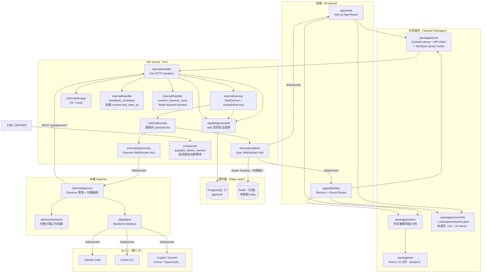
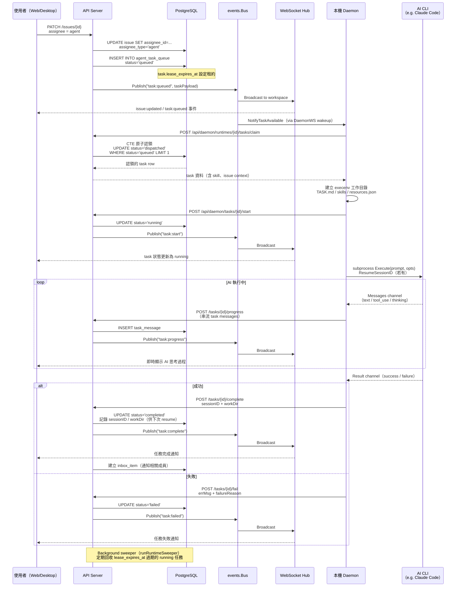

# Multica 系統架構文件

> 最後更新：2026-05-09
> 本文件基於 codebase 靜態分析產出；未驗證項目標注 ⚠️ 未驗證

---

## 1. 高層架構描述

Multica 是一個 AI-native 任務管理平台，核心概念是讓 AI agent 像人類同事一樣認領並執行 issue。系統分為三個主要執行環境：**API Server**（雲端或 self-hosted）、**Daemon**（使用者本機）、**AI CLI**（實際執行 AI 的工具）。



---

## 2. 元件清單

### 2.1 Go Backend

| 元件 | 職責 | 關鍵路徑 | 上游 | 下游 |
|------|------|---------|------|------|
| **cmd/server** | 進程入口、啟動順序協調 | `server/cmd/server/main.go` | — | 所有內部元件 |
| **router** | Chi 路由定義、middleware 堆疊、監聽器註冊 | `server/cmd/server/router.go` | main | handler, middleware |
| **handler** | HTTP request/response 處理、UUID 驗證 | `server/internal/handler/` | router | service, db |
| **TaskService** | 任務入隊、認領、進度、完成/失敗邏輯 | `server/internal/service/task.go` | handler, autopilot | db, events, realtime |
| **AutopilotService** | Cron + webhook 觸發的自動化任務分發 | `server/internal/service/autopilot.go` | handler, cron | TaskService |
| **EmailService** | 驗證碼 email（Resend） | `server/internal/service/email.go` | handler | Resend API |
| **events.Bus** | 進程內同步 pub/sub，保證 handler panic 不影響其他訂閱者 | `server/internal/events/bus.go` | service | realtime, activity, notification |
| **realtime.Hub** | 用戶 WebSocket 連線管理、workspace 範圍廣播 | `server/internal/realtime/` | events | 前端 WS clients |
| **daemonws.Hub** | Daemon WebSocket 連線管理、任務 wakeup 通知 | `server/internal/daemonws/` | events | daemon |
| **db/generated** | sqlc 自動產生的型別安全查詢（PostgreSQL） | `server/pkg/db/generated/` | handler, service | PostgreSQL |
| **agent.Backend** | AI CLI 統一執行介面（11 個實作） | `server/pkg/agent/` | daemon | Claude Code / Codex 等 subprocess |
| **storage** | 檔案上傳（S3 / Local），介面相同 | `server/internal/storage/` | handler | AWS S3 / 本地磁碟 |
| **auth** | JWT、PAT、Daemon Token 驗證、CloudFront 簽名 | `server/internal/auth/` | middleware | DB |
| **daemon** | Runtime 管理、任務輪詢/認領、GC | `server/internal/daemon/` | CLI | server REST API |
| **heartbeat_scheduler** | 批量更新 runtime `last_seen_at`，避免高頻個別 UPDATE | `server/internal/handler/` | handler | DB |
| **runtime_liveness_store** | Redis-backed runtime 在線狀態快取，降低 DB 查詢次數 | `server/internal/handler/` | handler | Redis |
| **autopilot_failure_monitor** | 監控高失敗率 runtime，自動暫停 autopilot 避免迴圈失敗 | `server/cmd/server/` | cmd/server | AutopilotService |

### 2.2 前端套件

| 套件 | 職責 | 關鍵路徑 | 規則 |
|------|------|---------|------|
| **packages/core** | Zustand stores、API client、TanStack Query hooks | `packages/core/` | 零 react-dom、零 localStorage 直接依賴 |
| **packages/ui** | shadcn/Base UI atomic 元件 | `packages/ui/` | 零 `@multica/core` 依賴 |
| **packages/views** | 共享業務頁面、表單、Modal | `packages/views/` | 零 `next/*`、零 `react-router-dom` |
| **apps/web** | Next.js App Router、SSR、Cookie auth | `apps/web/` | 唯一可用 `next/*` 的地方 |
| **apps/desktop** | Electron + electron-vite、多 tab、WindowOverlay | `apps/desktop/` | 唯一可用 `react-router-dom` 的地方 |

---

## 3. 分層設計說明

### 3.1 Go Backend 分層

```
HTTP Request
    ↓
[middleware] AuthOrBadRequest → RequireWorkspaceMembership
    ↓
[handler/]  parseUUIDOrBadRequest → loadIssueForUser（loader pattern）
    ↓
[service/]  TaskService / AutopilotService（業務邏輯、交易管理）
    ↓
[db/generated/]  sqlc Queries（型別安全 SQL，無 ORM 抽象洩漏）
    ↓
PostgreSQL 17
```

Handler 層明確分工：
- **輸入驗證**：`parseUUIDOrBadRequest`（返回 400）或 `parseUUID`（panic → 500）
- **存取控制**：loader 函式（`loadIssueForUser`）解析資源並驗證 workspace 成員資格
- **業務邏輯**：委派給 Service 層，handler 不直接操作 DB（除單純查詢外）

### 3.2 前端分層

```
apps/web or apps/desktop
    ↓ (platform 層 - NavigationAdapter / StorageAdapter)
packages/views (業務頁面，framework agnostic)
    ↓
packages/core (Zustand stores + TanStack Query hooks + API client)
    ↓
packages/ui (Atomic UI，無業務邏輯)
```

依賴方向嚴格單向：`views → core + ui`，`core` 與 `ui` 互相獨立。

**狀態管理分工**：

| 狀態類型 | 工具 | 位置 |
|---------|------|------|
| 伺服器資料（issues、agents、workspace...） | TanStack Query | 所有 fetch 邏輯 in `core/` |
| UI 選擇、過濾器、草稿 | Zustand | `packages/core/` stores |
| Auth / Workspace 全局狀態 | Zustand（特殊） | `authStore`（唯一可直接呼叫 API） |
| Cross-cutting platform | React Context | `WorkspaceIdProvider`、`NavigationProvider` |

---

## 4. 通訊模式

### 4.1 前端 ↔ API Server：REST + WebSocket

- **REST（HTTPS）**：所有 CRUD 操作，`X-Workspace-ID` header 路由到正確 workspace
- **WebSocket（/ws）**：用戶訂閱即時事件（issue 更新、task 進度、inbox 通知）
  - 連線建立後，server push workspace 範圍內的事件
  - 前端收到事件後呼叫 `queryClient.invalidateQueries()` 觸發重新 fetch（不直接寫 store）

### 4.2 Daemon ↔ API Server：REST polling + WebSocket wakeup

- **REST（/api/daemon/*）**：Daemon token（`mdt_` 前綴）認證
  - 任務認領：`POST /api/daemon/runtimes/{id}/tasks/claim`（原子 SQL CTE）
  - 任務生命週期：`/tasks/{id}/start`, `/progress`, `/complete`, `/fail`
- **WebSocket（/api/daemon/ws）**：Server 主動推送 wakeup 信號，避免 daemon 無效輪詢

### 4.3 進程內：events.Bus

- 同步 pub/sub，保證事件順序
- Service 層 publish 事件 → 監聽器群組（WS 廣播、activity log、notification、autopilot）
- 每個 handler 有 `recover()` 保護，單個 handler panic 不影響其他

### 4.4 多節點：Redis Relay

- 僅在 `REDIS_URL` 設定時啟用
- 三種模式：`sharded`（分片 streams，預設）、`dual`（滾動升級雙寫）、`legacy`（舊版單 stream）
- `EmptyClaimCache`：Redis-backed 快取「runtime 無待執行任務」，減少 DB scan

---

## 5. 關鍵設計決策

### 決策 1：sqlc 取代 ORM

**決策**：使用 sqlc 從 SQL 自動產生型別安全的 Go 程式碼，不使用 GORM 等 ORM。

**理由**：
- SQL 完全可審計，無 N+1 問題的隱患
- 型別由編譯器保證，sqlc 在 codegen 時驗證 SQL 正確性
- 複雜查詢（任務認領 CTE、pgvector 搜尋）在 ORM 中難以表達

**Trade-off**：新增欄位需更新 SQL + 執行 `make sqlc` 重新生成；彈性低於動態 ORM。

---

### 決策 2：Daemon 在本機執行 AI CLI

**決策**：AI agent 執行在使用者本機 daemon，而非在 server 端 sandbox。

**理由**：
- AI CLI（Claude Code、Codex 等）需要存取本地 git repo 和檔案系統
- 避免將 API key 上傳至 server
- 使用者可以選擇自己信任的 AI 工具

**Trade-off**：需要使用者安裝並維持 daemon 運行；網路中斷會中止任務；server 無法直接控制執行環境。

---

### 決策 3：Agent Backend 統一介面（`pkg/agent.Backend`）

**決策**：所有 AI CLI 實作相同的 `Backend` interface，工廠函式按類型分發。

**理由**：
- 新增 AI CLI 支援只需新增一個檔案 + 在 switch case 中登記，其餘 daemon 邏輯不變
- Session 串流模型（`Messages chan + Result chan`）統一讓 UI 即時顯示各 CLI 的 token 輸出

**Trade-off**：各 CLI 的參數差異（`--print` vs `--json` 等）被吸收在各 Backend 實作中，偶爾需要平台特定 workaround（如 `cursor.go` 的多平台調用策略）。

---

### 決策 4：Internal Packages 不預編譯（raw TS export）

**決策**：`packages/core`、`packages/ui`、`packages/views` 直接匯出 `.ts`/`.tsx` 原始碼，不預先編譯成 JS。

**理由**：
- 零配置 HMR：修改 shared 套件後，consuming app 的 bundler 直接感知變更
- Go-to-definition 直接跳到源碼，無需 sourcemap
- 省去套件的 build pipeline 和版本發布流程

**Trade-off**：每個 app 都需要承擔編譯 shared 套件的時間；若 shared 套件型別錯誤，兩個 app 都會 fail。

---

### 決策 5：TanStack Query 擁有所有伺服器狀態，Zustand 只管 UI 狀態

**決策**：嚴格分工，API 資料不得複製到 Zustand store；WS 事件只觸發 invalidation，不直接寫 store。

**理由**：
- 避免兩個真相來源（server cache vs Zustand store）產生漂移
- workspace 切換自動失效：cache key 包含 `wsId`，切換 workspace 舊資料即消失
- 樂觀更新（optimistic mutation）有固定 pattern：本地先套用 → 送請求 → 失敗回滾 → settle 後 invalidate

**Trade-off**：WS 事件 → invalidation → refetch 增加一次網路往返；對超高頻更新場景（如大量 task progress）需要節流策略。

---

### 決策 6：Handler 層 UUID 解析公約（防止靜默零 UUID bug）

**決策**：依輸入來源使用三種不同的 UUID 解析方式（`parseUUIDOrBadRequest` / `loadIssueForUser` loader / `parseUUID` panic）。

**理由**：
- 舊版 `util.ParseUUID` 對無效輸入靜默返回零 UUID，導致 `DELETE` 回傳 204 但實際匹配零行（issue #1661）
- 不同來源的信任等級不同，公約強制開發者思考「這個 UUID 從哪裡來」

**Trade-off**：增加新手學習曲線；需在 code review 中嚴格執行。

---

### DD-7：i18n 架構 — 語言包位於 views/locales，runtime 切換不重載

**決策**：翻譯資源（21 namespaces）集中在 `packages/views/locales/<lang>/`，core 層提供語言切換 API（`packages/core/i18n/`），語言偏好存於 `user.language` DB 欄位，透過 cookie 在 SSR / CSR 間同步。

**取捨**：字串型別安全（TypeScript 型別由 `packages/views/i18n/resources-types.ts` 自動推導）換取 JSON 格式的可讀性與外部貢獻便利性。

**替代方案**：曾考慮 `next-intl`（僅限 Next.js）或 `react-i18next`（需打包 runtime），最終選擇輕量 custom adapter 確保 Electron + Next.js 兩端共用相同 API。

---

### DD-8：Timeline Cursor Pagination — 大型 Issue 效能

**決策**（PR #2128）：Issue timeline 從 offset pagination 改為 keyset cursor pagination（migration 068 新增索引）。

**問題背景**：大型 issue（數百條 comment）的 offset 查詢隨頁數增加線性退化，在生產環境出現明顯凍結（MUL-1968）。

**實作**：cursor 基於 `created_at + id` keyset，支援 "Show older" / "Show newer" 雙向導航，`has_more_before` / `has_more_after` 標記邊界。

---

### DD-9：task_usage_daily — 物化彙整替代即時 GROUP BY

**決策**（PR #2256）：新增 `task_usage_daily` 物化表，以 pg_cron 每小時更新，取代 `ListRuntimeUsage` 對 `task_usage` 原始事件流的 `SUM() GROUP BY DATE(created_at)` 查詢。

**問題背景**：隨 token 使用事件累積，runtimes 列表頁每次載入都對大表做全掃描彙整，DB 負載持續攀升。

**取捨**：最多 1 小時的彙整延遲（可接受），換取 O(days × providers × models) vs O(events) 的查詢複雜度大幅下降。

---

## 6. 任務生命週期 Sequence Diagram



---

## 7. 部署模式對照

| 模式 | Redis | AI 執行位置 | 備註 |
|------|-------|-----------|------|
| Cloud（multica.ai） | 是（多節點） | 使用者本機 daemon | 官方托管 |
| Self-hosted（單機） | 否（可選） | 使用者本機 daemon | `docker-compose.selfhost.yml` |
| Self-hosted Advanced | 是（必要） | 使用者本機 daemon | Kubernetes / 多 API pod |

---

## 8. 擴充點速覽

| 擴充點 | 介面位置 | 新增方式 |
|-------|---------|---------|
| 新增 AI CLI 支援 | `server/pkg/agent/agent.go:Backend` | 實作 interface + 工廠 switch case + daemon 偵測 |
| 新增 Storage 後端 | `server/internal/storage/storage.go:Storage` | 實作 interface + router.go 初始化判斷 |
| 新增 Realtime 廣播策略 | `server/internal/realtime/hub.go:Broadcaster` | 實作 `Broadcaster` 或 `ManagedRelay` |
| 新增 domain event hook | `server/internal/events/bus.go` | `bus.Subscribe(EventType, handler)` in router.go |
| 新增前端平台（第三個 app） | `packages/views/platform/` | 實作 `NavigationAdapter` + `StorageAdapter` |
| 新增 Desktop pre-workspace 流程 | `apps/desktop/src/renderer/src/stores/window-overlay-store.ts` | 新增 overlay type + 攔截路徑 |
