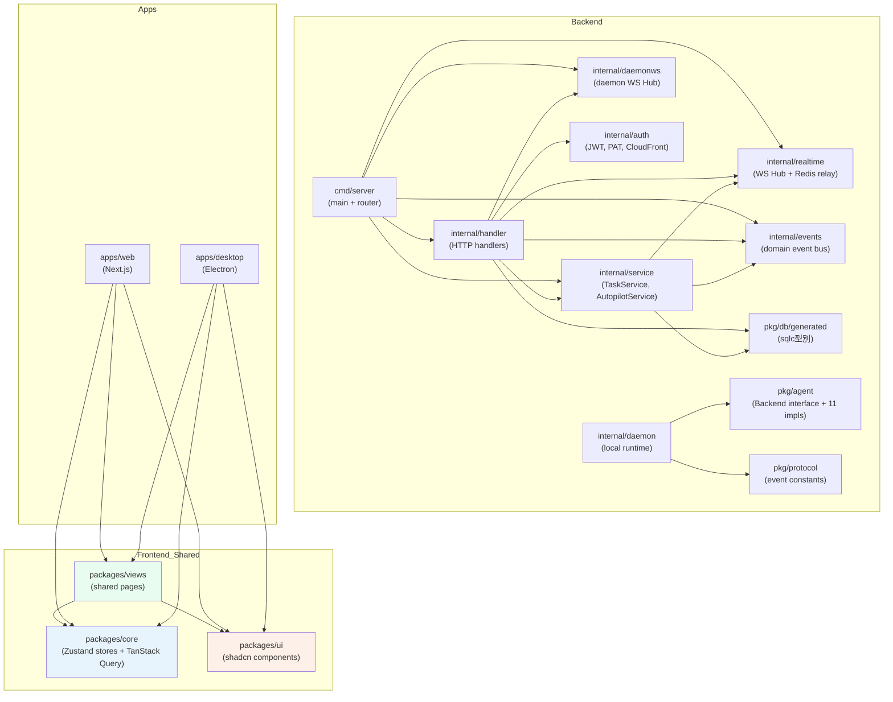

# 程式碼地圖

## Annotated Directory Tree

```
multica/
│
├── server/                          # Go Backend（API server + CLI + daemon）
│   ├── cmd/
│   │   ├── server/                  # API Server 進入點
│   │   │   ├── main.go             # 啟動序列（DB→Redis→WS Hub→Router→HTTP）
│   │   │   ├── router.go           # Chi router + 全部路由定義
│   │   │   └── autopilot_failure_monitor.go  # Autopilot 高失敗率自動暫停監控器
│   │   ├── multica/                 # CLI + Daemon 進入點
│   │   │   └── main.go             # Cobra CLI 根命令
│   │   └── migrate/                 # DB migration 工具
│   │       └── main.go
│   │
│   ├── internal/                    # 私有業務邏輯
│   │   ├── handler/                 # HTTP 請求處理（每個資源一個檔案）
│   │   │   ├── handler.go          # Handler struct + 建構函式
│   │   │   ├── issue.go            # Issue CRUD + 任務觸發邏輯
│   │   │   ├── agent.go            # Agent 管理
│   │   │   ├── daemon.go           # Daemon/Runtime API（任務生命週期）
│   │   │   ├── auth.go             # 認證（email OTP + Google OAuth）
│   │   │   ├── chat.go             # Chat session API
│   │   │   ├── autopilot.go        # Autopilot CRUD + trigger
│   │   │   ├── skill.go            # Skill 管理
│   │   │   ├── heartbeat_scheduler.go        # 批量寫入 runtime last_seen_at（效能優化）
│   │   │   ├── runtime_liveness_store.go     # Redis-backed runtime liveness 快取
│   │   │   ├── workspace_reserved_slugs.go   # 從 JSON 載入保留 slugs
│   │   │   └── ...                 # 其他資源 handler
│   │   │
│   │   ├── service/                 # 業務邏輯（跨 handler 共用）
│   │   │   ├── task.go             # 任務佇列核心（enqueue/claim/complete/fail）
│   │   │   ├── autopilot.go        # Autopilot 分發邏輯
│   │   │   ├── email.go            # Email 服務（Resend）
│   │   │   └── cron.go             # Autopilot 排程器
│   │   │
│   │   ├── daemon/                  # 本地 Daemon runtime
│   │   │   ├── daemon.go           # Daemon 主體（Run() + handleTask()）
│   │   │   ├── wakeup.go           # WS 喚醒 loop
│   │   │   ├── client.go           # Daemon HTTP client
│   │   │   ├── identity.go         # CLI 偵測（掃描 PATH）
│   │   │   ├── local_skills.go     # 本地 skill 同步
│   │   │   ├── gc.go               # 工作目錄垃圾回收
│   │   │   ├── diskusage.go        # Disk usage CLI（per-task / per-workspace）
│   │   │   ├── prompt.go           # 任務 prompt 建構
│   │   │   ├── health.go           # Daemon health 端點
│   │   │   ├── repocache/          # Git bare clone 快取
│   │   │   └── execenv/            # 任務隔離執行環境
│   │   │       ├── execenv.go      # 環境準備（目錄結構 + 注入 skill）
│   │   │       ├── git.go          # Git worktree 操作
│   │   │       └── context.go      # Context 檔案生成（TASK.md）
│   │   │
│   │   ├── realtime/                # 用戶 WebSocket Hub
│   │   │   ├── hub.go              # WS 連線管理 + 廣播
│   │   │   ├── redis_relay.go      # Redis stream relay（多節點）
│   │   │   └── sharded_relay.go    # 分片 Redis stream relay
│   │   │
│   │   ├── daemonws/                # Daemon WebSocket Hub（單獨 WS 端點）
│   │   │   └── hub.go              # Daemon WS 連線 + wakeup dispatch
│   │   │
│   │   ├── events/                  # 進程內 Domain Event Bus
│   │   │   └── bus.go              # Pub/sub bus（同步執行）
│   │   │
│   │   ├── auth/                    # 認證工具
│   │   │   ├── jwt.go              # JWT 簽發 + 驗證
│   │   │   ├── pat.go              # Personal Access Token
│   │   │   ├── pat_cache.go        # PAT Redis 快取
│   │   │   └── cloudfront.go       # CloudFront URL 簽名
│   │   │
│   │   ├── middleware/              # Chi middleware
│   │   │   ├── auth.go             # JWT/PAT/daemon token 驗證
│   │   │   └── workspace.go        # Workspace 成員驗證
│   │   │
│   │   ├── analytics/              # Analytics 客戶端介面
│   │   ├── metrics/                # Prometheus 指標
│   │   ├── storage/                # 檔案儲存介面（S3 + 本地）
│   │   ├── mention/                # @mention 解析
│   │   ├── cli/                    # CLI 命令實作
│   │   ├── migration/              # Migration 工具函式
│   │   └── util/                   # 通用工具（UUID 解析等）
│   │
│   ├── pkg/                         # 可重用公共套件
│   │   ├── agent/                   # AI CLI 統一抽象層
│   │   │   ├── agent.go            # Backend interface + 工廠函式
│   │   │   ├── claude.go           # Claude Code backend
│   │   │   ├── codex.go            # Codex backend
│   │   │   └── ...                 # 其他 10 個 backend
│   │   ├── db/generated/           # sqlc 自動生成（勿手動編輯）
│   │   │   ├── queries.sql.go      # 型別安全的 DB 查詢函式
│   │   │   └── models.go           # DB 模型型別
│   │   ├── protocol/               # WS 事件協議定義
│   │   │   ├── events.go           # 事件類型常數（EventIssueCreated 等）
│   │   │   └── messages.go         # 訊息結構
│   │   └── redact/                 # 敏感資料遮蓋工具
│   │
│   └── migrations/                  # SQL migration 檔案（78 個）
│       ├── 001_init.up.sql         # 初始 schema
│       └── ...                     # 增量 migration
│
├── apps/
│   ├── web/                         # Next.js Web 應用（App Router）
│   │   ├── app/
│   │   │   ├── layout.tsx          # 根 layout（字型 + Provider）
│   │   │   ├── (auth)/             # 認證相關路由（login、onboarding 等）
│   │   │   ├── (landing)/          # Landing page、changelog、download
│   │   │   └── [workspaceSlug]/    # Workspace 主路由
│   │   │       ├── layout.tsx      # Workspace guard + 設定 workspace context
│   │   │       └── (dashboard)/    # 儀表板路由
│   │   │           ├── issues/     # Issue 列表 + 詳情
│   │   │           ├── agents/     # Agent 列表 + 詳情
│   │   │           ├── runtimes/   # Runtime 監控
│   │   │           ├── skills/     # Skill 管理
│   │   │           ├── autopilots/ # Autopilot 管理
│   │   │           ├── projects/   # 專案管理
│   │   │           ├── inbox/      # 通知中心
│   │   │           └── settings/   # Workspace 設定
│   │   ├── platform/               # Next.js 特定平台層
│   │   │   └── navigation.tsx      # next/navigation 包裝為 NavigationAdapter
│   │   ├── components/             # Web 專屬元件
│   │   └── features/               # Web 特定功能（cookie auth 等）
│   │
│   └── desktop/                     # Electron 桌面應用
│       └── src/
│           ├── main/               # Electron main process
│           ├── preload/            # Electron preload scripts
│           └── renderer/           # 渲染進程（React）
│               └── src/
│                   ├── stores/     # Desktop 特定 stores（tabs、overlay）
│                   ├── platform/   # react-router-dom NavigationAdapter
│                   └── components/ # Desktop 特定 UI
│
├── packages/
│   ├── core/                        # 無依賴業務邏輯（零 react-dom）
│   │   ├── api/                    # API client + hook
│   │   ├── auth/                   # Auth store（Zustand）
│   │   ├── issues/                 # Issue queries + hooks
│   │   ├── agents/                 # Agent queries + hooks
│   │   ├── chat/                   # Chat store + queries
│   │   ├── autopilots/             # Autopilot queries
│   │   ├── projects/               # Project queries
│   │   ├── workspace/              # Workspace queries
│   │   ├── inbox/                  # Inbox queries
│   │   ├── realtime/               # WS client（WSProvider）
│   │   ├── platform/               # CoreProvider + workspace storage
│   │   ├── navigation/             # NavigationAdapter interface
│   │   ├── permissions/            # 權限計算邏輯
│   │   ├── modals/                 # Global modal state
│   │   ├── types/                  # 共用 TypeScript 型別
│   │   └── i18n/                   # i18n 系統（語言切換 + user preference sync）
│   │
│   ├── ui/                          # Atomic UI 元件（零業務邏輯）
│   │   ├── components/ui/          # shadcn 元件（Button、Dialog 等）
│   │   ├── components/common/      # 通用元件（MulticaIcon 等）
│   │   ├── styles/                 # 共用樣式（Tailwind base + CSS vars）
│   │   ├── hooks/                  # 純 UI hooks（useMediaQuery 等）
│   │   └── markdown/               # Markdown 渲染元件
│   │
│   ├── views/                       # 共用業務頁面/元件（零 next/* 依賴）
│   │   ├── issues/                 # Issue 頁面 + 元件
│   │   ├── agents/                 # Agent 頁面
│   │   ├── skills/                 # Skill 頁面
│   │   ├── autopilots/             # Autopilot 頁面
│   │   ├── chat/                   # Chat UI
│   │   ├── layout/                 # Dashboard 佈局（DashboardGuard 等）
│   │   ├── auth/                   # 登入 + Onboarding 頁面
│   │   ├── inbox/                  # Inbox 頁面
│   │   ├── settings/               # 設定頁面
│   │   ├── workspace/              # Workspace 管理頁面
│   │   ├── i18n/                   # Views i18n 整合（useT hook + resource types）
│   │   └── locales/                # 翻譯資源（en + zh-Hans，21 namespaces）
│   │
│   └── tsconfig/                    # 共用 TypeScript 設定
│
├── e2e/                             # Playwright E2E 測試
├── scripts/                         # 安裝腳本（install.sh、install.ps1）
├── docker/                          # Docker 設定
├── docs/                            # 設計文件、產品概覽
├── Makefile                         # 開發工作流指令
├── pnpm-workspace.yaml              # pnpm workspaces + catalog（版本鎖定）
├── turbo.json                       # Turborepo pipeline 設定
└── .env.example                     # 環境變數範例
```

---

## 「我想改 X 要看哪裡？」速查表

| 我想要... | 看這裡 | 關鍵檔案 |
|-----------|--------|---------|
| 新增一個 REST API endpoint | `server/internal/handler/` | `handler.go`（struct）、對應資源的 `*.go` |
| 在路由中掛載新 endpoint | `server/cmd/server/router.go` | `router.go:254+`（routes 區段） |
| 新增一個 DB table | `server/migrations/` | 新增 `NNN_*.up.sql` 和 `.down.sql` |
| 新增 sqlc 查詢 | `server/pkg/db/queries/` | 寫 SQL query，再 `make sqlc` 重新生成 |
| 新增一個 AI CLI 支援 | `server/pkg/agent/` | 新建 `myagent.go`，在 `agent.go:New()` 加 case |
| 修改任務執行流程 | `server/internal/daemon/` | `daemon.go:handleTask()`、`execenv/execenv.go` |
| 修改 Autopilot 邏輯 | `server/internal/service/` | `autopilot.go:DispatchAutopilot()` |
| 新增前端頁面（Web + Desktop） | `packages/views/<domain>/` | 新建 view，再在兩個 app 中路由 |
| 修改 Web 路由 | `apps/web/app/[workspaceSlug]/` | 對應的 `page.tsx` |
| 修改共用 UI 元件 | `packages/ui/components/` | `ui/`（shadcn）或 `common/` |
| 修改 issue 的 TanStack Query | `packages/core/issues/` | `index.ts`（query options）、`hooks.ts` |
| 修改 auth 邏輯（前端） | `packages/core/auth/` | `auth-store.ts` |
| 修改 workspace context | `packages/core/platform/` | `workspace-storage.ts`、`core-provider.tsx` |
| 修改 WS 事件處理 | `packages/core/realtime/` | `ws-provider.tsx`、`events.ts` |
| 修改 Desktop 多 tab | `apps/desktop/src/renderer/src/stores/` | `tab-store.ts` |
| 修改 Realtime Hub | `server/internal/realtime/` | `hub.go` |
| 修改 Email 模板 | `server/internal/service/email.go` | `email.go` |
| 修改 Daemon 認證 | `server/internal/middleware/` | `auth.go`（`mdt_` prefix 處理） |
| 新增 Prometheus 指標 | `server/internal/metrics/` | `metrics.go` |
| 修改 Docker Compose 設定 | 根目錄 | `docker-compose.selfhost.yml` |
| 修改 CI 流程 | `.github/workflows/` | `ci.yml`、`release.yml` |
| 新增 shadcn 元件 | `packages/ui/` | `pnpm ui:add <component>` |
| 修改 skill 注入路徑 | `server/internal/daemon/execenv/` | `execenv.go`（provider-specific paths） |
| 新增翻譯字串 | `packages/views/locales/<lang>/<namespace>.json` | 對應 namespace JSON 檔 |
| 修改 i18n 語言切換邏輯 | `packages/core/i18n/` | `create-i18n.ts`、`user-locale-sync.tsx` |
| 修改 autopilot 失敗率監控 | `server/cmd/server/autopilot_failure_monitor.go` | `failureMonitorConfig` 結構體 |
| 查看 runtime 磁碟用量 | `server/internal/daemon/diskusage.go` | `DiskUsageCmd` |

---

## 模組依賴關係圖



---

## 套件邊界規則（硬性約束）

| 套件 | 禁止匯入 | 原因 |
|------|---------|------|
| `packages/core/` | `react-dom`, `localStorage`, `process.env`, UI 庫 | 要在 Node 環境可執行 |
| `packages/ui/` | `@multica/core` | 純 UI，零業務邏輯 |
| `packages/views/` | `next/*`, `react-router-dom` | 零框架依賴，跨平台共用 |
| `apps/*/platform/` | 其他 app 的 platform 目錄 | 平台隔離 |

違反這些邊界會破壞跨平台架構，`pnpm typecheck` 會報錯。
