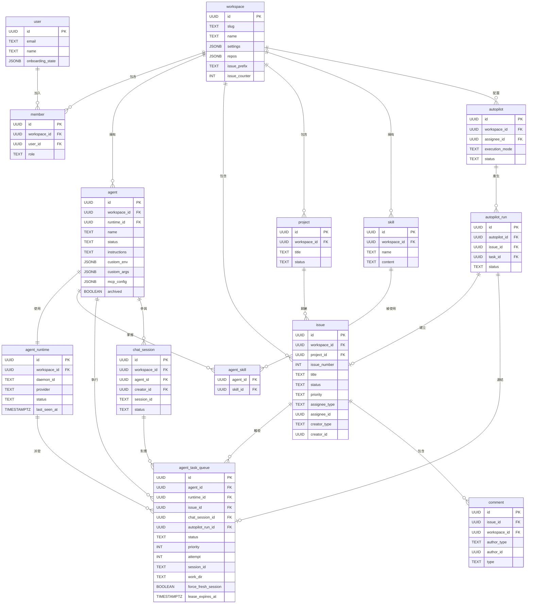
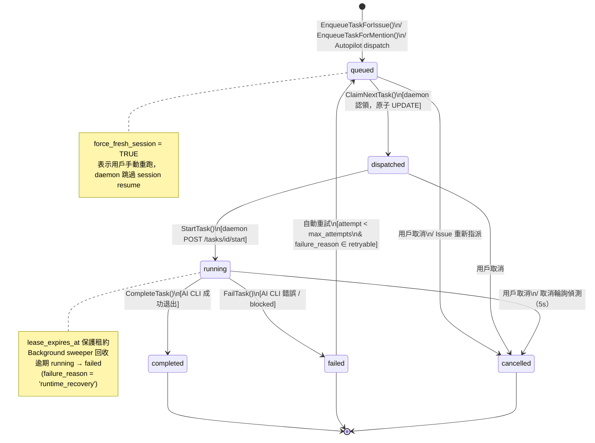

# DATA_MODEL.md — Multica 資料模型文件

> 資料來源：`server/migrations/001_init.up.sql`～`067_*.up.sql`、`server/pkg/db/generated/`、`.trace/_context/`

---

## 1. 核心 Entity 清單

### 1.1 多租戶基礎

#### `user`（`001_init.up.sql`）
| 欄位 | 型別 | 說明 |
|------|------|------|
| `id` | UUID PK | 主鍵 |
| `name` | TEXT | 顯示名稱 |
| `email` | TEXT UNIQUE | 登入 Email |
| `avatar_url` | TEXT | 頭像 URL |
| `onboarding_state` | JSONB | onboarding 進度（`051`）|
| `onboarded_at` | TIMESTAMPTZ | 完成 onboarding 時間（`050`）|
| `starter_content_state` | JSONB | 新手內容狀態（`054`）|
| `created_at` / `updated_at` | TIMESTAMPTZ | 時間戳記 |

#### `workspace`（`001_init.up.sql`）
| 欄位 | 型別 | 說明 |
|------|------|------|
| `id` | UUID PK | 主鍵 |
| `name` | TEXT | 工作區名稱 |
| `slug` | TEXT UNIQUE | URL 識別碼（保留詞審計由 `043～049` 完成）|
| `description` | TEXT | 描述 |
| `settings` | JSONB | 設定（`{}`） |
| `context` | TEXT | 工作區 context（`002`）|
| `repos` | JSONB | Git repo 列表（`014`） |
| `issue_prefix` / `issue_counter` | TEXT / INT | 人類可讀 Issue 編號（`020`）|

#### `member`（`001_init.up.sql`）
| 欄位 | 型別 | 說明 |
|------|------|------|
| `id` | UUID PK | 主鍵 |
| `workspace_id` | UUID FK | 外鍵→`workspace` |
| `user_id` | UUID FK | 外鍵→`user` |
| `role` | TEXT | `owner` / `admin` / `member` |

---

### 1.2 Agent 系統

#### `agent`（`001_init.up.sql` + 多個後續 migration）
| 欄位 | 型別 | 說明 |
|------|------|------|
| `id` | UUID PK | 主鍵 |
| `workspace_id` | UUID FK | 外鍵→`workspace` |
| `name` | TEXT | 唯一名稱（`046` 加 UNIQUE）|
| `avatar_url` | TEXT | 頭像 |
| `runtime_mode` | TEXT | `local` / `cloud` |
| `runtime_id` | UUID FK | 外鍵→`agent_runtime`（`004`）|
| `status` | TEXT | `idle`/`working`/`blocked`/`error`/`offline` |
| `instructions` | TEXT | Agent 指令（`021`）|
| `max_concurrent_tasks` | INT | 最大並行任務數 |
| `custom_env` | JSONB | 自訂環境變數（`040`）|
| `custom_args` | JSONB | 自訂 CLI 參數（`041`）|
| `mcp_config` | JSONB | MCP 設定（`046`）|
| `owner_id` | UUID FK | 外鍵→`user`，私人 agent 擁有者 |
| `visibility` | TEXT | `workspace` / `private` |
| `archived` | BOOLEAN | 是否歸檔（`031`）|
| `description` | TEXT | Agent 描述（長度擴展 `060`）|
| `model` | TEXT | 使用的 AI 模型（`050_agent_model`）|

#### `agent_runtime`（`004_agent_runtime_loop.up.sql`）
| 欄位 | 型別 | 說明 |
|------|------|------|
| `id` | UUID PK | 主鍵 |
| `workspace_id` | UUID FK | 外鍵→`workspace` |
| `daemon_id` | TEXT | Daemon UUID（`048` 改為持久化 UUID）|
| `legacy_daemon_id` | TEXT | 舊 hostname 識別碼（`048`）|
| `name` | TEXT | Runtime 名稱 |
| `runtime_mode` | TEXT | `local` / `cloud` |
| `provider` | TEXT | AI CLI 類型（`claude`/`codex` 等）|
| `status` | TEXT | `online` / `offline` |
| `device_info` | TEXT | 設備資訊 |
| `metadata` | JSONB | 其他元數據 |
| `owner_id` | UUID FK | 外鍵→`user`（`032_runtime_owner`）|
| `last_seen_at` | TIMESTAMPTZ | 最後心跳時間 |

---

### 1.3 Issue 追蹤

#### `issue`（`001_init.up.sql` + 多個後續 migration）
| 欄位 | 型別 | 說明 |
|------|------|------|
| `id` | UUID PK | 主鍵 |
| `workspace_id` | UUID FK | 外鍵→`workspace` |
| `issue_number` | INT | 人類可讀編號（`020`）|
| `title` | TEXT | 標題 |
| `description` | TEXT | 描述（Markdown）|
| `status` | TEXT | `backlog`/`todo`/`in_progress`/`in_review`/`done`/`blocked`/`cancelled` |
| `priority` | TEXT | `urgent`/`high`/`medium`/`low`/`none` |
| `assignee_type` | TEXT | `member` / `agent`（多型態）|
| `assignee_id` | UUID | 外鍵→`user` 或 `agent` |
| `creator_type` | TEXT | `member` / `agent` |
| `creator_id` | UUID | 多型態外鍵 |
| `parent_issue_id` | UUID FK | 外鍵→`issue`（子 issue）|
| `project_id` | UUID FK | 外鍵→`project`（`034`）|
| `acceptance_criteria` | JSONB | 驗收標準列表 |
| `context_refs` | JSONB | 外部資源連結 |
| `position` | FLOAT | 排序位置 |
| `due_date` | TIMESTAMPTZ | 截止日 |
| `origin_type` | TEXT | `autopilot`（`042`）|
| `origin_id` | UUID | Autopilot run 來源（`042`）|
| `first_executed_at` | TIMESTAMPTZ | 首次執行時間（`050_issue_first_executed_at`）|

#### `issue_label` / `issue_to_label`（`001_init.up.sql`）
多對多關聯。`issue_label` 含 `name`、`color`；`issue_to_label` 為 junction table。`label_timestamps`（`059`）加入時間戳記。

#### `issue_dependency`（`001_init.up.sql`）
欄位：`issue_id`、`depends_on_issue_id`、`type`（`blocks`/`blocked_by`/`related`）

#### `issue_subscriber`（`015`）
追蹤誰訂閱了哪個 issue 的通知。含 `subscriber_type`（`member`/`agent`）、`subscriber_id`。

---

### 1.4 任務執行系統

#### `agent_task_queue`（`001_init.up.sql` + 多個後續 migration）
| 欄位 | 型別 | 說明 |
|------|------|------|
| `id` | UUID PK | 主鍵 |
| `agent_id` | UUID FK | 外鍵→`agent` |
| `runtime_id` | UUID FK | 外鍵→`agent_runtime`（`004`）|
| `issue_id` | UUID FK | 外鍵→`issue`（nullable，`033`）|
| `chat_session_id` | UUID FK | 外鍵→`chat_session`（`033`）|
| `autopilot_run_id` | UUID FK | 外鍵→`autopilot_run`（`042`）|
| `trigger_comment_id` | UUID FK | 外鍵→`comment`（`028`）|
| `parent_task_id` | UUID FK | 外鍵→`agent_task_queue`，重試父任務（`055`）|
| `status` | TEXT | 見 §2 狀態機 |
| `priority` | INT | 優先級數值 |
| `attempt` | INT | 當前嘗試次數（`055`）|
| `max_attempts` | INT | 最大重試次數（`055`）|
| `failure_reason` | TEXT | 失敗原因分類（`055`）|
| `session_id` | TEXT | AI CLI session ID（用於 resume）|
| `work_dir` | TEXT | 本機工作目錄 |
| `force_fresh_session` | BOOLEAN | 強制新 session（`066`）|
| `lease_expires_at` | TIMESTAMPTZ | 租約過期時間（`055`）|
| `last_heartbeat_at` | TIMESTAMPTZ | 任務心跳（`055`）|
| `trigger_summary` | TEXT | 觸發摘要（`061`）|
| `dispatched_at` / `started_at` / `completed_at` | TIMESTAMPTZ | 各階段時間戳記 |
| `result` | JSONB | 執行結果 |
| `error` | TEXT | 錯誤訊息 |

#### `task_message`（`026_*.up.sql`）
串流任務輸出。含 `task_id`、`role`、`content`、`created_at`。

#### `task_usage`（`032_task_usage.up.sql`）
Token 用量追蹤。含 `task_id`、`input_tokens`、`output_tokens`、`model`。

---

### 1.5 技能系統

#### `skill`（`008_structured_skills.up.sql`）
| 欄位 | 型別 | 說明 |
|------|------|------|
| `id` | UUID PK | 主鍵 |
| `workspace_id` | UUID FK | 外鍵→`workspace` |
| `name` | TEXT UNIQUE | 技能名稱（workspace 內唯一）|
| `description` | TEXT | 描述 |
| `content` | TEXT | SKILL.md 主體內容 |
| `config` | JSONB | 設定 |
| `created_by` | UUID FK | 外鍵→`user` |

#### `skill_file`（`008_structured_skills.up.sql`）
技能附屬檔案。含 `skill_id`、`path`、`content`。

#### `agent_skill`（`008_structured_skills.up.sql`）
Agent-Skill 多對多 junction table。

---

### 1.6 Autopilot 自動化

#### `autopilot`（`042_autopilot.up.sql`）
| 欄位 | 型別 | 說明 |
|------|------|------|
| `id` | UUID PK | 主鍵 |
| `workspace_id` | UUID FK | 外鍵→`workspace` |
| `title` | TEXT | 標題 |
| `assignee_id` | UUID FK | 外鍵→`agent` |
| `execution_mode` | TEXT | `create_issue` / `run_only` |
| `status` | TEXT | `active`/`paused`/`archived` |
| `concurrency_policy` | TEXT | `skip`/`queue`/`replace` |
| `issue_title_template` | TEXT | Issue 標題模板 |
| `last_run_at` | TIMESTAMPTZ | 最近執行時間 |

#### `autopilot_trigger`（`042_autopilot.up.sql`）
觸發器定義：`kind`（`schedule`/`webhook`/`api`）、`cron_expression`、`timezone`、`next_run_at`、`webhook_token`。

#### `autopilot_run`（`042_autopilot.up.sql`）
一次執行紀錄：連結 `autopilot_id`、`trigger_id`、`issue_id`、`task_id`；`status`（`pending`/`issue_created`/`running`/`skipped`/`completed`/`failed`）。

---

### 1.7 協作與對話

#### `comment`（`001_init.up.sql`）
欄位：`issue_id`、`workspace_id`（`025`）、`author_type`（`member`/`agent`）、`author_id`、`content`、`type`（`comment`/`status_change`/`progress_update`/`system`）、`parent_id`（`017`，thread 支援）。

#### `comment_reaction` / `issue_reaction`（`026`/`027`）
Emoji reaction，多型態（`reactor_type`/`reactor_id`）。

#### `chat_session`（`033_chat.up.sql`）
用戶與 Agent 的持久化對話。欄位：`agent_id`、`creator_id`、`session_id`（AI CLI session）、`work_dir`、`status`（`active`/`archived`）、`unread_since`（`040`）、`runtime_id`（`060`）。

#### `chat_message`（`033_chat.up.sql`）
對話訊息：`chat_session_id`、`role`（`user`/`assistant`）、`content`、`task_id`、`failure_reason`（`062`）、`elapsed_ms`（`063`）。

---

### 1.8 專案管理

#### `project`（`034_projects.up.sql`）
| 欄位 | 型別 | 說明 |
|------|------|------|
| `id` | UUID PK | 主鍵 |
| `workspace_id` | UUID FK | 外鍵→`workspace` |
| `title` | TEXT | 標題 |
| `status` | TEXT | `planned`/`in_progress`/`paused`/`completed`/`cancelled` |
| `lead_type` | TEXT | `member` / `agent` |
| `lead_id` | UUID | 多型態外鍵 |

#### `project_resource`（`065_project_resources.up.sql`）
多型態外部資源連結（`resource_type` + `resource_ref` JSONB，如 `github_repo`）。

---

### 1.9 認證與安全

#### `personal_access_token`（`011_personal_access_tokens.up.sql`）
PAT 記錄。含 `user_id`、`workspace_id`（可選）、`name`、`token_hash`、`expires_at`。

#### `daemon_token`（`029_*.up.sql`）
Daemon 認證 token（`mdt_` 前綴）。含 `runtime_id`、`token_hash`。

#### `verification_code`（`009_verification_code.up.sql`）
Email 驗證碼。含 `email`、`code`、`attempts`（`010`）、`expires_at`。

#### `daemon_pairing_session`（`005_daemon_pairing.up.sql`）
Daemon 配對 session，短效憑證交換用。

---

### 1.10 輔助功能

| Table | 說明 |
|-------|------|
| `inbox_item` | 收件匣通知，含 `recipient_type`/`recipient_id`（多型）、`actor_type`/`actor_id`、`severity`、`read`/`archived` |
| `notification_preference` | 用戶通知偏好設定（`064`）|
| `activity_log` | 審計日誌，含 `actor_type`/`actor_id`、`action`、`details` JSONB |
| `attachment` | 附件記錄，含 `storage_key`、`mime_type`、`size` |
| `pinned_item` | 固定項目（`038`），多型 `item_type`/`item_id` |
| `workspace_invitation` | 邀請記錄，含 `status`（`pending`/`accepted`/`declined`/`expired`）、`expires_at` |
| `feedback` | 用戶回饋（`057`）|

---

## 2. ER Diagram



---

## 3. 任務狀態機（agent_task_queue）



**狀態說明：**

| 狀態 | 觸發者 | 說明 |
|------|--------|------|
| `queued` | `TaskService.EnqueueTaskForIssue()` | 任務入列，等待 daemon 認領 |
| `dispatched` | `ClaimNextTask()` SQL 原子操作 | Daemon 認領，防止競爭 |
| `running` | `POST /api/daemon/tasks/{id}/start` | Daemon 已啟動 AI CLI |
| `completed` | `POST /api/daemon/tasks/{id}/complete` | AI CLI 成功退出 |
| `failed` | `POST /api/daemon/tasks/{id}/fail` | AI CLI 錯誤或 blocked |
| `cancelled` | `PATCH /api/issues/{id}` 重新指派 / 用戶主動取消 | 舊任務取消 |

---

## 4. 前端 State 管理對照

### 4.1 Server State（TanStack Query / React Query）

所有從 API 取得的資料存於 Query cache，以 `[resource, wsId, ...params]` 為 key。

| 資源 | Query Key 範例 | 說明 |
|------|----------------|------|
| Issues 列表 | `['issues', wsId, filters]` | workspace 切換自動失效 |
| Issue 詳情 | `['issue', wsId, issueId]` | 包含 assignee、labels |
| Agents | `['agents', wsId]` | workspace 內所有 agent |
| Agent Runtimes | `['runtimes', wsId]` | Daemon 狀態 |
| Tasks | `['tasks', wsId, issueId]` | Issue 的任務歷史 |
| Task Messages | `['task-messages', taskId]` | 串流輸出 |
| Skills | `['skills', wsId]` | workspace 技能庫 |
| Projects | `['projects', wsId]` | 專案列表 |
| Inbox | `['inbox', wsId, userId]` | 收件匣 |
| Chat Sessions | `['chat-sessions', wsId]` | 對話列表 |
| Chat Messages | `['chat-messages', sessionId]` | 對話內容 |
| Workspace Members | `['members', wsId]` | 成員列表 |

**更新機制**：WS 事件（如 `issue:updated`、`task:complete`）觸發 `queryClient.invalidateQueries()`，不直接寫入 store，保持 cache 為單一事實來源。

**Optimistic Update 模式**：Mutation 先在本地更新 cache，請求失敗後 rollback，完成後 invalidate。

### 4.2 Client State（Zustand，位於 `packages/core/`）

| Store | 內容 | 持久化 |
|-------|------|--------|
| `authStore` | 當前用戶資料、JWT token、onboarding 狀態 | 是（加密 cookie / secure storage）|
| `workspaceStore` | `currentWorkspaceId`、`currentWorkspaceSlug` | 否（session 期間）|
| `chatStore` | chat 草稿、pending 訊息 | 部分 |
| `tabStore`（Desktop only）| 多 tab 管理，per-workspace 分組 | 是（用戶重啟恢復）|
| `windowOverlayStore`（Desktop only）| pre-workspace 流程狀態（建立 workspace、接受邀請）| 否（ephemeral）|

**Store 工廠模式**（`packages/core/platform/`）：
```ts
const authStore = createAuthStore({ api, storage, onLogin, onLogout, cookieAuth })
registerAuthStore(authStore)
```
避免 singleton 測試污染；store 透過 `CoreProvider` 初始化注入。

**禁止行為**：
- 不得將 API 資料複製進 Zustand（雙重事實來源）
- 不得在 store 內直接呼叫 `api.*`（例外：authStore 和 workspaceStore）

---

## 5. 資料生命週期說明

### 5.1 Task（agent_task_queue）完整生命週期

```
建立
  └─ [用戶指派 Issue 給 Agent] PATCH /api/issues/{id}
      → TaskService.CancelTasksForIssue（取消舊任務）
      → TaskService.EnqueueTaskForIssue
          → INSERT agent_task_queue (status='queued')
          → broadcastTaskEvent(task:queued)
          → notifyTaskAvailable → DaemonWS hub 推送 task:available

等待認領
  └─ [Daemon 收到 WS 或輪詢 /tasks/claim]
      → ClaimNextTask（原子 UPDATE status='dispatched'）
      → 回傳 task context（skills, repos, issue, agent config）

執行中
  └─ [Daemon POST /tasks/{id}/start]
      → status = 'running', started_at = now()
      └─ [Daemon 執行 AI CLI，串流 stdout 到 task_message]
          → 每 5s 輪詢 task status（取消偵測）
          → lease_expires_at 保護（sweeper 回收逾期租約）

完成
  └─ [Daemon POST /tasks/{id}/complete]
      → status = 'completed', completed_at = now()
      → 若有 comment → INSERT comment (author_type='agent')
      → 若 issue.status = 'in_progress' → UPDATE issue.status = 'in_review'
      → Bus.Publish(EventTaskCompleted)
          → registerActivityListeners → INSERT activity_log
          → registerNotificationListeners → INSERT inbox_item
          → WS broadcast → 前端 invalidateQueries

失敗與重試
  └─ status = 'failed', failure_reason 分類
      → 若 attempt < max_attempts & 可重試 → 建立新任務（parent_task_id 指回）
      → 否則結束，通知 inbox

淘汰
  └─ 完成/失敗/取消後的任務記錄永久保存（審計用）
  └─ 工作目錄（~/.multica_workspaces/）由 GC daemon 定期清理（TTL-based）
  └─ session_id + work_dir 保留供下次任務 resume 使用
```

### 5.2 Issue 生命週期

`backlog → todo → in_progress → in_review → done`（可跳轉；`blocked`/`cancelled` 可從任何狀態進入）

Agent 完成任務後自動推進到 `in_review`；人工審核後移至 `done`。

### 5.3 Chat Session 生命週期

建立（`status='active'`）→ 對話中（`task_id` 關聯執行任務）→ 完成訊息（`unread_since` 標記）→ 用戶讀取（`unread_since = NULL`）→ 歸檔（`status='archived'`，軟刪除）。

---

## 6. Migration 機制

### 6.1 管理方式

Migration 由自訂 Go tool 管理（`server/internal/migrations/`），非第三方框架。

**命名規則**：`{序號}_{描述}.up.sql` / `{序號}_{描述}.down.sql`

- 序號範圍：`001`～`067`（共 68 個 migration，但因同一序號可有多個檔案，實際檔案數 > 68）
- 同一序號多個檔案（如 `050_agent_model.up.sql`、`050_add_onboarded_at_to_users.up.sql`）代表同批次的平行改動

**執行指令**：
```bash
make migrate-up     # 執行所有未套用的 migration
make migrate-down   # 回滾最後一個 migration
make db-reset       # 清除並重建（僅本機）
```

### 6.2 重要 Migration 里程碑

| Migration | 內容 |
|-----------|------|
| `001` | 初始 schema（user, workspace, member, agent, issue, comment, task queue）|
| `004` | `agent_runtime` 獨立表；task queue 加 `runtime_id` |
| `008` | Structured Skills（skill / skill_file / agent_skill）|
| `020` | 人類可讀 Issue 編號（`MUL-123` 格式）|
| `033` | Chat session / message；task queue issue_id 改 nullable |
| `034` | Project 表；issue 加 `project_id` |
| `042` | Autopilot / autopilot_trigger / autopilot_run |
| `043～049` | Reserved slug 審計（防止 workspace slug 與路由衝突）|
| `055` | Task 租約保護（`lease_expires_at`）與重試機制（`attempt`/`max_attempts`/`parent_task_id`）|
| `065` | `project_resource`（多型態外部資源連結）|
| `066` | `force_fresh_session`（手動重跑強制新 session）|
| `067` | `idx_agent_task_queue_claim_candidates` 部分索引（claim 效能優化）|

### 6.3 索引策略

關鍵效能索引（`067` 最新）：
```sql
-- Daemon claim 熱路徑（僅索引 queued 狀態，大幅縮小索引大小）
CREATE INDEX CONCURRENTLY idx_agent_task_queue_claim_candidates
    ON agent_task_queue (runtime_id, priority DESC, created_at ASC)
    WHERE status = 'queued';
```

其他重要索引：`idx_issue_workspace`、`idx_issue_assignee`、`idx_agent_task_queue_agent`、`idx_agent_runtime_status`。

---

*文件生成時間：2026-05-05*
*資料來源版本：migrations 001～067*
