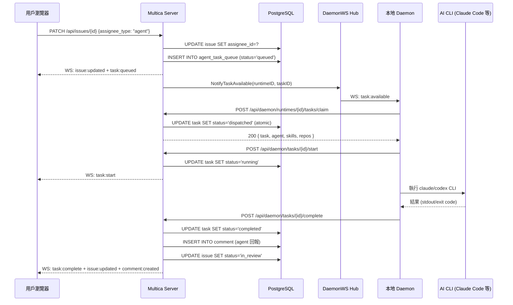

# Stage 2.2 Data Flow

## 代表性 Use Case：將 Issue 指派給 Agent 並執行任務

此流程涵蓋 Multica 最核心的端對端路徑：從用戶在 UI 操作，到 AI agent 在本機執行並回報結果。

---

## Phase 1：用戶指派 Issue 給 Agent（HTTP PUT）

```
瀏覽器 → Next.js → [PATCH /api/issues/{id}]
```

**前端** (`packages/core/issues/`)：
1. 用戶在 Issue 詳情頁選擇 agent assignee
2. TanStack Query mutation 呼叫 `api.patch(/api/issues/{id}, { assignee_type: "agent", assignee_id: "<uuid>" })`
3. Optimistic update：立刻更新 React Query cache，UI 立刻響應
4. `X-Workspace-ID` header 由 `ApiClient` 自動注入（從 `setCurrentWorkspace` 讀取）

**後端 handler** (`server/internal/handler/issue.go:1302` `UpdateIssue`)：

```
請求進入 → middleware chain:
  1. chimw.Recoverer (panic recovery)
  2. chimw.RequestID
  3. middleware.AuthOrBadRequest → 驗證 JWT/PAT token
  4. middleware.RequireWorkspaceMembership → 確認用戶是 workspace 成員
  
→ h.UpdateIssue(w, r)
  1. loadIssueForUser(id) → 支援 UUID 或 "MUL-123" 格式，DB 查詢解析
  2. json.Unmarshal(body) → UpdateIssueRequest
  3. 追蹤哪些欄位明確設定（rawFields map）
  4. 建立 db.UpdateIssueParams，合併 prev + new 值
  5. validateAssigneePair → 驗證 agent 存在於 workspace
  6. h.Queries.UpdateIssue(ctx, params) → sqlc 執行 SQL UPDATE
  7. h.publish(EventIssueUpdated, ...) → 廣播 WS 事件給所有訂閱者
  8. 若 assigneeChanged:
     a. h.TaskService.CancelTasksForIssue → 取消舊任務
     b. h.TaskService.EnqueueTaskForIssue → 建立新任務
  9. writeJSON(w, 200, resp) → 回傳更新後的 issue
```

---

## Phase 2：TaskService 排入任務佇列

**服務層** (`server/internal/service/task.go:EnqueueTaskForIssue`)：

```
EnqueueTaskForIssue(ctx, issue)
  ↓
enqueueIssueTask(ctx, issue, commentID, forceFreshSession=false)
  1. 驗證 issue.AssigneeID 有效
  2. GetAgent(ctx, issue.AssigneeID) → 確認 agent 存在且有 runtime
  3. 確認 agent 未 archived
  4. s.Queries.CreateAgentTask(ctx, CreateAgentTaskParams{
       AgentID:   issue.AssigneeID,
       RuntimeID: agent.RuntimeID,  // 哪個 daemon 要執行
       IssueID:   issue.ID,
       Priority:  priorityToInt(issue.Priority),
     }) → INSERT INTO agent_task_queue ... RETURNING *
  5. s.broadcastTaskEvent(ctx, EventTaskQueued, task) → WS 廣播
  6. s.notifyTaskAvailable(task)  ← 關鍵：喚醒 daemon
```

**任務狀態**：此時 `agent_task_queue.status = 'queued'`

---

## Phase 3：Daemon 收到 WS 喚醒訊號

**Daemon WS Hub** (`server/internal/daemonws/hub.go`)：
- `DaemonHub.NotifyTaskAvailable(runtimeID, taskID)` 找到對應的 daemon WS 連線
- 推送 `task:available` 訊息給 daemon

**Daemon** (`server/internal/daemon/wakeup.go:taskWakeupLoop`)：
- daemon 維護與 server 的 WS 連線（`/api/daemon/ws`）
- 收到 `task:available` → 通知 `taskWakeups` channel
- 若 WS 斷線：fallback 到 3s HTTP polling（`MULTICA_DAEMON_POLL_INTERVAL`）

---

## Phase 4：Daemon 認領任務

**Daemon** → **HTTP POST `/api/daemon/runtimes/{runtimeId}/tasks/claim`**

**Server handler** (`server/internal/handler/daemon.go:820` `ClaimTaskByRuntime`)：
1. `requireDaemonRuntimeAccess` → 驗證 daemon token (`mdt_` prefix) + runtime ownership
2. `TaskService.ClaimTaskForRuntime(ctx, runtimeUUID)`:
   - EmptyClaimCache 快速路徑：若近期已知無任務，跳過 DB scan
   - `Queries.ClaimNextTask(ctx, runtimeUUID)` → `UPDATE agent_task_queue SET status='dispatched'`（原子操作）
3. 建立完整的 `ClaimTaskResponse`：
   - task 基本資料
   - agent name、instructions、skills（所有 SKILL.md 檔案內容）
   - agent 的 custom_env、custom_args、mcp_config
   - workspace repos（或 project-bound repos）
   - issue context、trigger summary
4. 廣播 `task:dispatch` WS 事件
5. 回傳 `{ task: {...} }`

**任務狀態**：`status = 'dispatched'`

---

## Phase 5：Daemon 執行任務

**Daemon** (`server/internal/daemon/daemon.go:1164` `handleTask`)：

```
handleTask(ctx, task, slot)
  1. client.StartTask(taskID) → POST /api/daemon/tasks/{id}/start
     → DB: status = 'running', started_at = now()
     → WS broadcast: task:start
  
  2. client.ReportProgress → 每步驟更新 UI
  
  3. 建立取消偵測 goroutine（每 5s 輪詢 task status）
  
  4. runTask(runCtx, task, provider, slot, logger):
     a. 準備工作目錄（git clone / 從 session 恢復）
     b. 注入 skill 檔案到 .claude/skills/ 等目錄
     c. 建構 agent prompt（issue title + description + criteria + context + skill references）
     d. 執行 AI CLI（e.g. `claude --print "<prompt>"` 或 `codex run`）
     e. 捕獲 stdout/stderr，stream 到 server（task messages）
     f. 解析退出結果（completed/blocked/failed）
  
  5. result 回傳後：
     - 若 blocked：client.FailTask(taskID, comment, sessionID, workDir, "agent_error")
     - 若完成：client.CompleteTask(taskID, comment, branchName, sessionID, workDir)
```

---

## Phase 6：任務完成回報

**Server** (`server/internal/handler/daemon.go` `CompleteTask`)：
1. 驗證 daemon access
2. `TaskService.CompleteTask(ctx, taskID, result, sessionID, workDir)`：
   - `UPDATE agent_task_queue SET status='completed', completed_at=now()`
   - 若有 comment：建立 comment 記錄（`author_type='agent'`）
   - 若 issue status 仍是 `in_progress`：更新為 `in_review`
   - `Bus.Publish(EventTaskCompleted)` → 觸發 activity log、inbox notification
3. WS 廣播 `task:complete`

**任務狀態**：`status = 'completed'`

---

## WebSocket 廣播路徑

```
Bus.Publish(event)
    ↓
EventListener (server/cmd/server/router.go registerListeners)
    ↓
broadcaster.Broadcast(workspaceID, payload)
    ↓
[單節點] realtime.Hub → 推送給所有訂閱該 workspace 的 WS 連線
[多節點] realtime.DualWriteBroadcaster → Hub + Redis stream
    ↓
瀏覽器接收 WS message
    ↓
packages/core/realtime/ → 解析 event type → queryClient.invalidateQueries(...)
    ↓
UI 自動重新 fetch，顯示最新狀態
```

---

## 完整序列圖（簡化）



---

## 關鍵設計點

1. **樂觀更新**：前端立刻更新 UI，WS 事件驗證並補全
2. **原子認領**：`ClaimNextTask` 是單一 SQL `UPDATE ... RETURNING`，防止多 daemon 搶同一任務
3. **Session 恢復**：task 帶有 `session_id` 和 `work_dir`，daemon 可以恢復上一次的 agent session（不從頭開始）
4. **取消偵測**：daemon 在執行中每 5s 輪詢 task status，若被取消則中斷 AI CLI 進程
5. **WS 喚醒 + HTTP polling fallback**：WS 是最優路徑（延遲 <100ms），polling 是容錯路徑（3s 週期）
